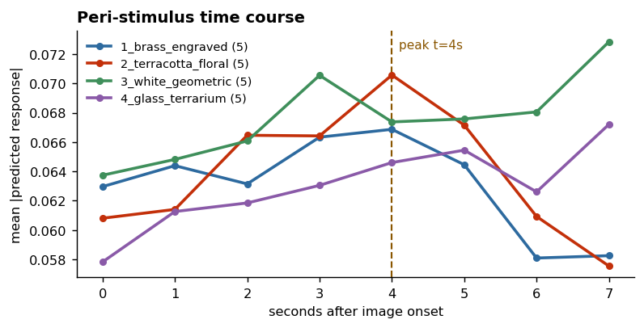
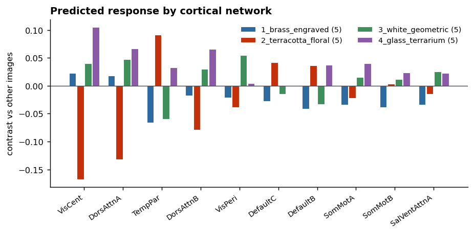
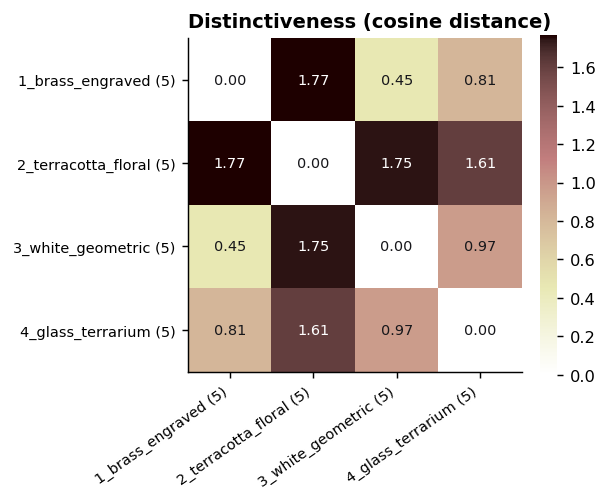
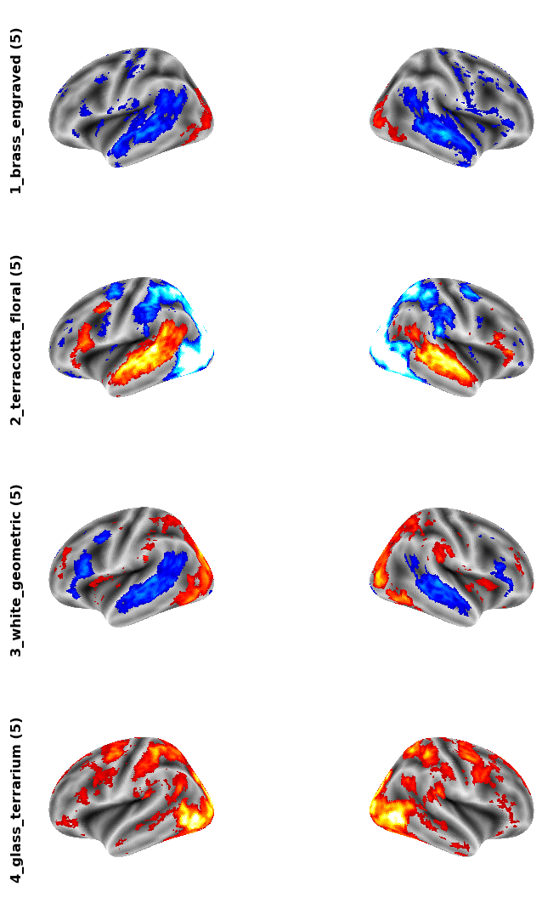

# Predicting cortical response to product images with TRIBE v2

Running Meta's **TRIBE v2** brain-encoding model on four AI-generated product images (decorative
planters) to compare their predicted cortical responses.

This repository contains a reproducible Colab notebook, the stimuli, the results, and — importantly —
an honest account of why the results should **not** be read as a finding about product design.

> **Not affiliated with Meta.** TRIBE v2 was created by the FAIR team at Meta. This is an independent
> application of their published model. All credit for the model belongs to them; any errors in this
> analysis are mine.

---

## Contents

| Path | What it is |
|---|---|
| [`notebooks/tribe_product_images.ipynb`](notebooks/tribe_product_images.ipynb) | Self-contained Colab notebook — upload images, get results |
| [`stimuli/`](stimuli/) | The four product images used |
| [`results/`](results/) | Output figures from the run documented below |
| [`scripts/`](scripts/) | Local (non-Colab) pipeline, including a memory watchdog |

---

## Quick start

[](https://colab.research.google.com/github/YOUR-USERNAME/tribev2-product-study/blob/main/notebooks/tribe_product_images.ipynb)

> Replace `YOUR-USERNAME` in the badge link above once you have pushed the repo, and the button will
> open the notebook directly in Colab.

1. Download [`notebooks/tribe_product_images.ipynb`](notebooks/tribe_product_images.ipynb)
2. Open [Google Colab](https://colab.research.google.com) → **File → Upload notebook**
3. **Runtime → Change runtime type → T4 GPU** (it will not finish on CPU)
4. **Runtime → Run all**, and select your images when prompted at cell 2
5. Figures and `results.json` download automatically at the end

Runtime on a free T4: **~31 minutes**, almost all of it video feature extraction.

---

## Method

TRIBE v2 takes video, audio and text. Still images aren't a supported input, so this follows the
protocol from the paper's own in-silico visual experiments (§5.9): each image is **flashed for 1 s**
against a mid-grey field with **8 s onset-to-onset spacing**, in randomised order, turning the set
into a short silent video.

Because the stimulus is silent, the pipeline skips word transcription and the **gated
`meta-llama/Llama-3.2-3B`** dependency entirely — no Hugging Face token required.

```
4 images x 2 repetitions, 8 s SOA  ->  64 s silent video, 8 trials
      |
      v
V-JEPA-2-giant (1.03B, frozen)     ->  128 clips x 8,192 tokens each
      |
      v
TRIBE v2 (177.2M, trained)         ->  (64 timesteps, 20,484 cortical vertices)
      |
      v
Trial alignment -> contrast maps -> Schaefer-400 / 17-network summary
```

**Run configuration**

| | |
|---|---|
| Hardware | Tesla T4 (Colab), CUDA, `torch 2.6.0+cu124` |
| TRIBE v2 | 177.2M trainable params, TR = 1.0 s |
| Mode | "unseen subject" — group-average prediction, zero-shot |
| Video encoding | 128 clips, 30 m 48 s (14.44 s/clip) |
| Total inference | 1,865 s |
| Output | `(64, 20484)` — one second per row, fsaverage5 vertices |
| Parcellation | Schaefer-400 / 17 networks; 18,741 of 20,484 vertices (1,743 medial-wall excluded) |
| Repetitions | 2 per image |

Two analysis details worth stating, because they're easy to get wrong:

- **The response peak is measured, not assumed.** The model card says predictions are already
  lag-corrected; the paper's §5.9 reads the response at t = 5 s. Both can't be true of the same
  index, so the notebook finds the peak empirically.
- **The medial wall is excluded.** Parcel 0 of the Schaefer annotation is
  `Background+FreeSurfer_Defined_Medial_Wall`, not a functional network. Including it silently
  contaminates every network average with 1,743 meaningless vertices.

---

## Results

Labels carry a trailing `(5)` — a Colab filename-collision artifact on upload, not meaningful.

### 1. Peri-stimulus time course



**Peak at t = 4 s.** This is the sanity check, and it passes: the haemodynamic response peaks
roughly 5 s after a stimulus, and at 1-second resolution 4 s is within tolerance. Trial alignment is
correct and the model is producing brain-shaped dynamics.

Individual curves are less reassuring. `brass_engraved` and `terracotta_floral` show a textbook rise
and decay. `white_geometric` and `glass_terrarium` are **still rising at t = 7 s** — which is not a
response to a 1-second flash, and most likely reflects bleed from the following trial through the
model's 100-second context window.

### 2. Predicted response by cortical network



Positive = this image drives that network more than the mean of the other three.

`terracotta_floral` is the outlier, and in a counterintuitive direction:

- **VisCent −0.167**, **DorsAttnA −0.131**, DorsAttnB −0.078 — markedly *less* central-visual and
  dorsal-attention response than its peers
- **TempPar +0.091**, DefaultC +0.041, DefaultB +0.036 — more temporoparietal and default-mode

`glass_terrarium` is positive across nearly every network; `brass_engraved` negative across nearly
every one.

> Schaefer network names describe resting-state connectivity, not cognitive function. Reading
> "salience network is up, therefore the viewer found it salient" is reverse inference and is not
> supported.

### 3. Distinctiveness



Cosine distance between whole-brain contrast maps, each centred before comparison — so this measures
**spatial pattern**, not overall magnitude. Range 0–2.

| Pair | Distance |
|---|---|
| terracotta ↔ brass | **1.769** ← most distinct |
| terracotta ↔ white | 1.75 |
| terracotta ↔ glass | 1.61 |
| white ↔ glass | 0.97 |
| brass ↔ glass | 0.81 |
| brass ↔ white | **0.454** ← most alike |

This is the most defensible output in the repository. "Do these produce different predicted
signatures" is a question about representation, which the model is equipped to answer — unlike
"which performs better", which requires outcome data the model has never seen.

### 4. Cortical surface maps



Lateral views, both hemispheres, inflated `fsaverage5`. Red = more response than the other images,
blue = less. These are plotted **un-centred**, so unlike figure 3 they are dominated by overall
magnitude — which is why `glass_terrarium` reads red almost everywhere and `brass_engraved` blue.

---

## Why these results should not be trusted as a finding

The pipeline works. The interpretation is the problem, and it's worth being explicit about:

**1. The direction is backwards.** `terracotta_floral` is by far the most visually busy image —
saturated flowers, painted pattern, wood grain, a bright window. It should drive central visual
networks *hardest*. Instead it is the most strongly negative, while a plain white pot on a white
background is positive. When a result inverts the most basic expectation, the leading hypothesis
should be an artifact.

**2. The images differ in everything at once.** Background (plain wall / wood table / white void /
window), luminance, colour saturation, clutter, framing, scale, and whether a living plant is
present. Early visual cortex responds strongly to exactly these low-level properties. What is most
likely being measured here is **photographic style, not product design** — and this design cannot
separate the two.

**3. Half the time courses are contaminated**, per figure 1.

**4. n = 2 presentations per image.** Thin. TRIBE is deterministic, so repetitions control for
sequence position rather than reducing noise, but two positions is still minimal.

**5. Objects are this model's weakest category.** In the paper (Fig. 4E), agreement between
predicted and measured brain responses was **0.79 for places, 0.74 for body parts, 0.64 for faces —
and 0.12 for tools and objects**. Product photography sits squarely in that blind spot.

**6. There is no behavioural data anywhere in this model.** No purchase intent, recall, preference,
or attention. It predicts a blood-oxygen signal. Any step from that to advertising performance is
inference the reader is supplying, not something the model did.

### What would make this a real experiment

- **Match the stimuli**: same background, lighting, framing, scale and plant; vary only the vessel
- **Widen the spacing**: 12 s SOA so responses fully decay
- **Add a control**: phase-scrambled versions preserving luminance and spatial-frequency content
  while destroying the object. If real-vs-scrambled is large and vase-vs-vase is small, the model is
  tracking image statistics rather than products
- **More repetitions**: 4+, which is cheap now that it runs on Colab

---

## Credits

**TRIBE v2 was created by the FAIR team at Meta.** All model design, training and validation is
their work.

> Stéphane d'Ascoli, Jérémy Rapin, Yohann Benchetrit, Teon Brookes, Katelyn Begany,
> Joséphine Raugel, Hubert Banville and Jean-Rémi King.
> *A foundation model of vision, audition, and language for in-silico neuroscience.*
> FAIR at Meta, 2026.

| Resource | Link |
|---|---|
| Meta AI announcement | https://ai.meta.com/blog/tribe-v2-brain-predictive-foundation-model/ |
| Meta AI research page | https://ai.meta.com/research/publications/a-foundation-model-of-vision-audition-and-language-for-in-silico-neuroscience/ |
| Paper (arXiv) | https://arxiv.org/abs/2605.04326 |
| Model code | https://github.com/facebookresearch/tribev2 |
| Model weights | https://huggingface.co/facebook/tribev2 |
| Interactive demo | https://aidemos.atmeta.com/tribev2 |

```bibtex
@article{dascoli2026foundation,
  title={A foundation model of vision, audition, and language for in-silico neuroscience},
  author={d'Ascoli, St{\'e}phane and Rapin, J{\'e}r{\'e}my and Benchetrit, Yohann and
          Brooks, Teon and Begany, Katelyn and Raugel, Jos{\'e}phine and Banville, Hubert
          and King, Jean-R{\'e}mi},
  journal={arXiv preprint arXiv:2605.04326},
  year={2026}
}
```

Also used: the [Schaefer 2018 parcellation](https://github.com/ThomasYeoLab/CBIG) (Yeo lab, CBIG),
[nilearn](https://nilearn.github.io/), and V-JEPA-2, Wav2Vec-BERT 2.0 and Llama 3.2 as frozen
feature extractors.

---

## Licence

The **TRIBE v2 weights and code are released by Meta under CC-BY-NC-4.0 — non-commercial use only.**
Using the model to select or evaluate advertising is commercial use. Check with your legal team
before applying any of this in a commercial setting.

The notebook and analysis scripts in this repository are MIT-licensed. The stimulus images are
AI-generated.
